# bai3

1. Vẽ sơ đồ thực thể liên kết ERD.

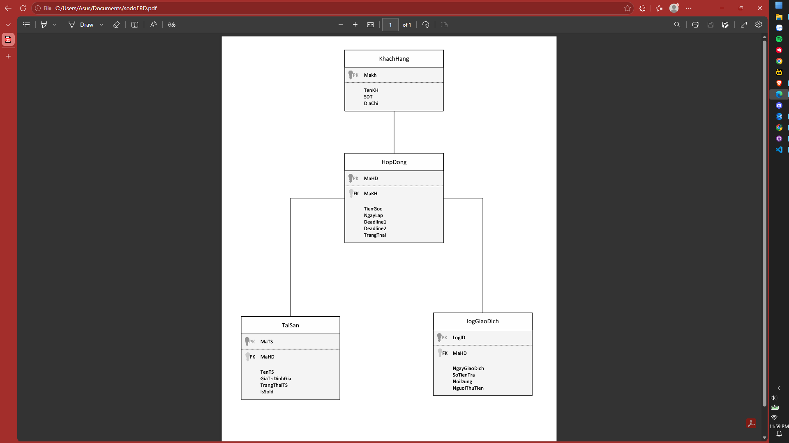

2.Tạo Bảng Hop Dong

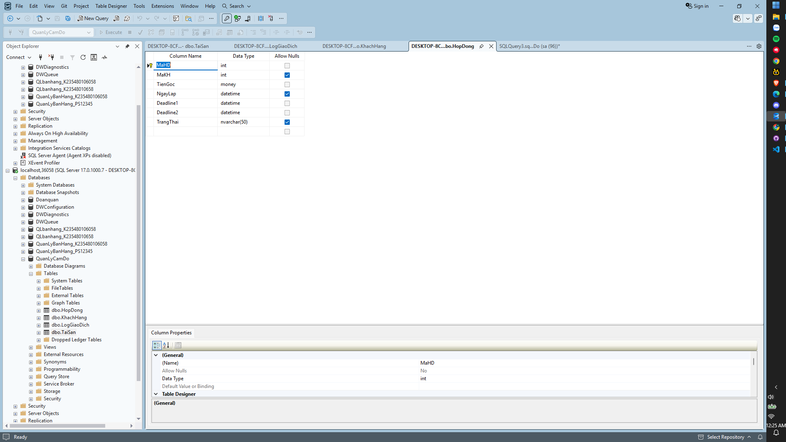

Tạo Bảng Khách Hàng

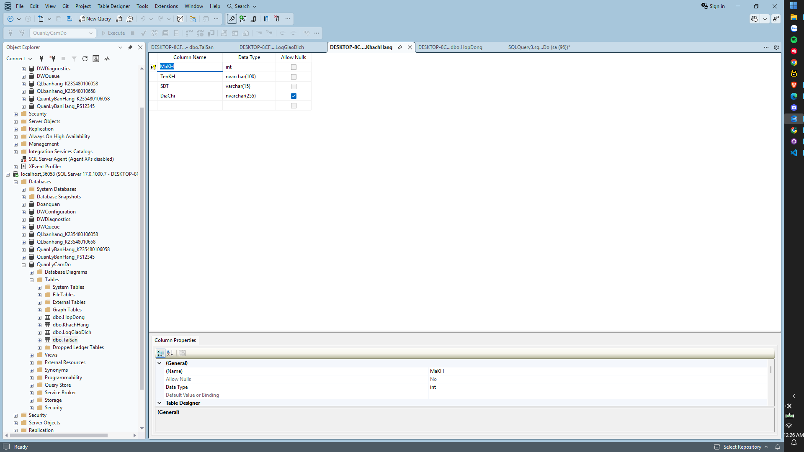

Tạo Bảng Log Giao Dịch

!([image]image/4.png)

tạo Bảng Tài Sản

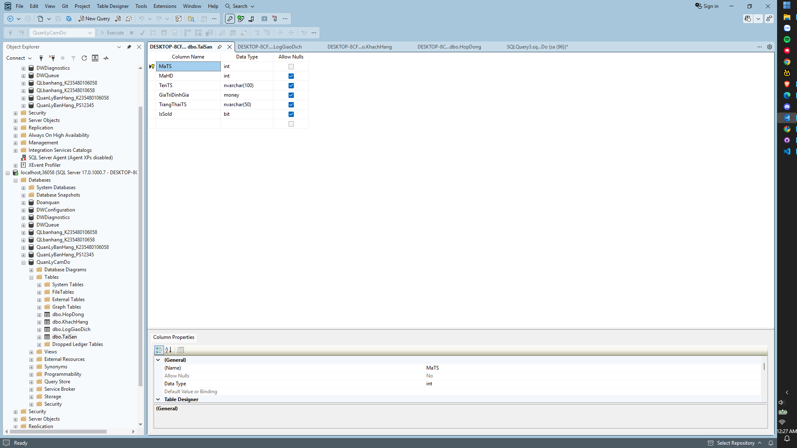

Create Database Quản Lý Cầm đồ

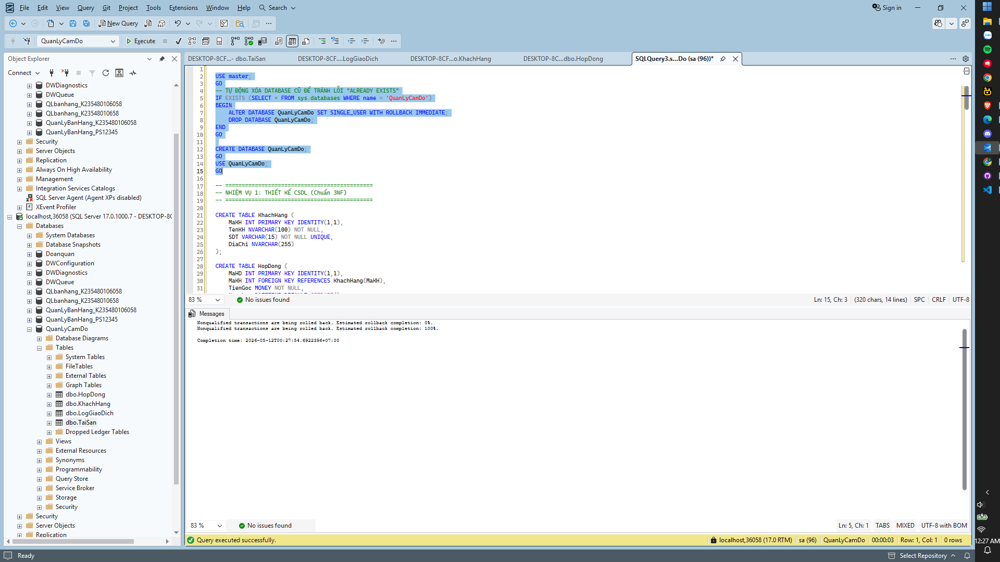

Nhiệm vụ 1:

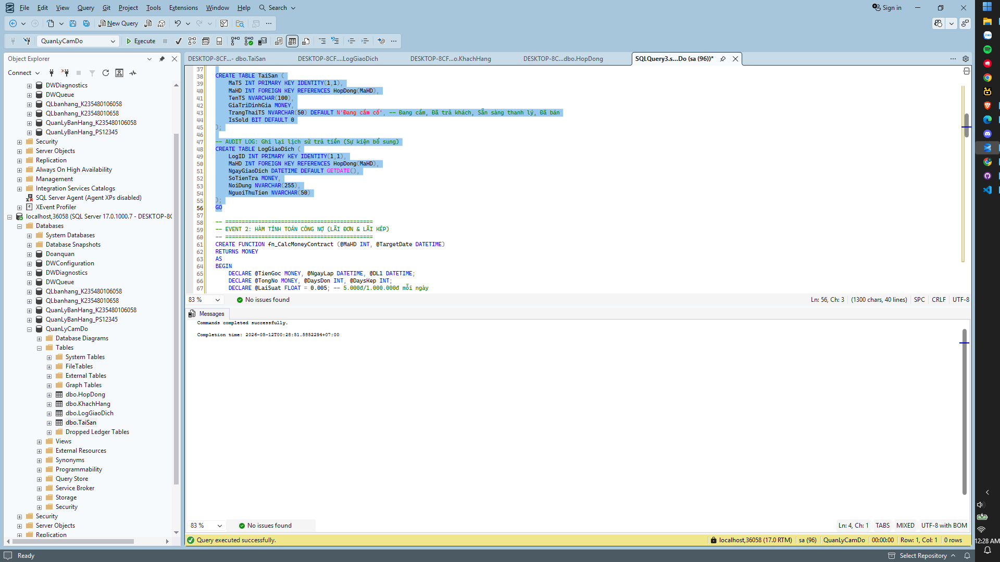

Event 1: Đăng ký hợp đồng mới (Vay tiền)

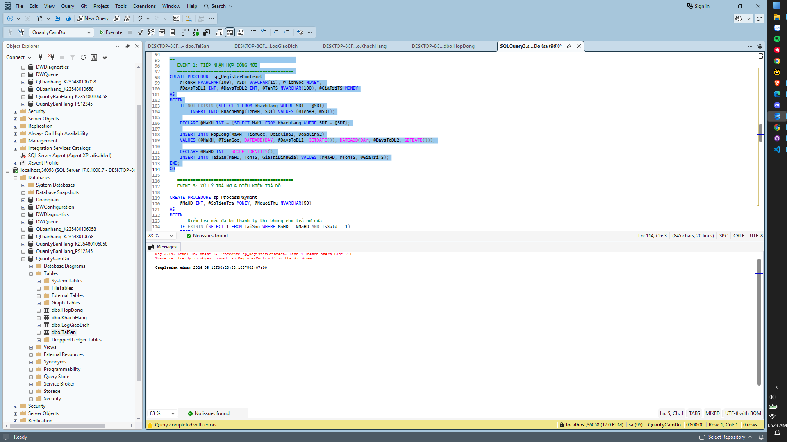

Event 2: Tính toán công nợ thời gian thực

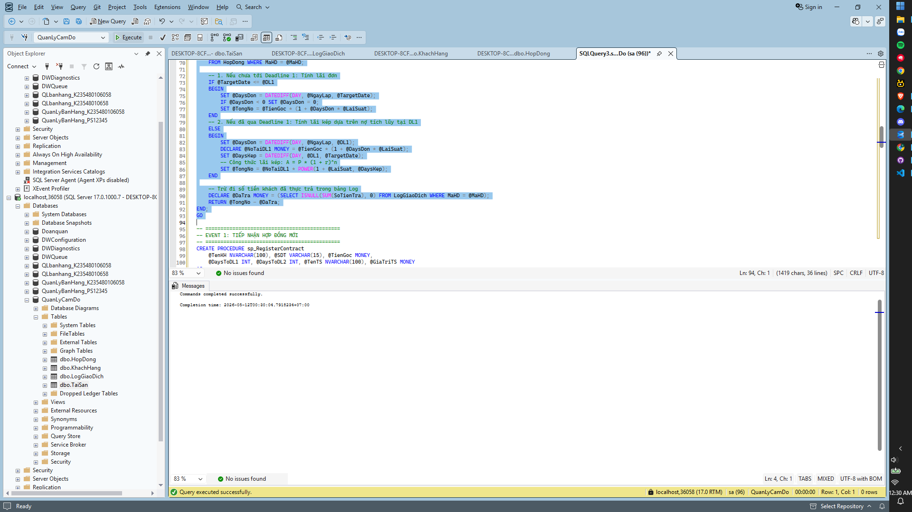

Event 3: Xử lý trả nợ và hoàn trả tài sản

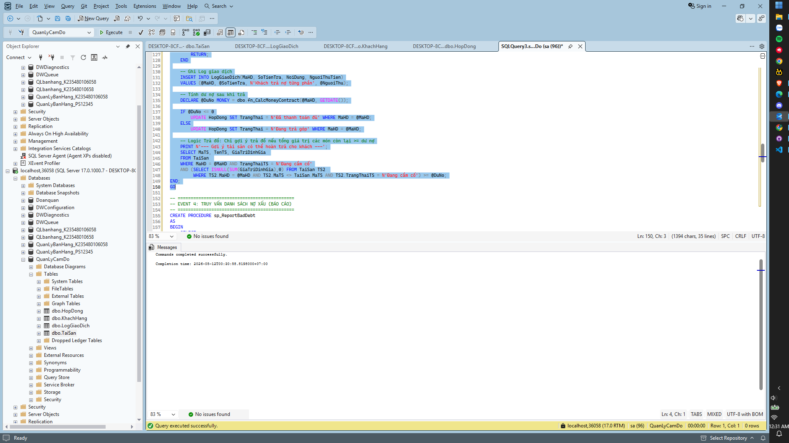

Event 4: Truy vấn danh sách nợ xấu (Nợ khó đòi) 

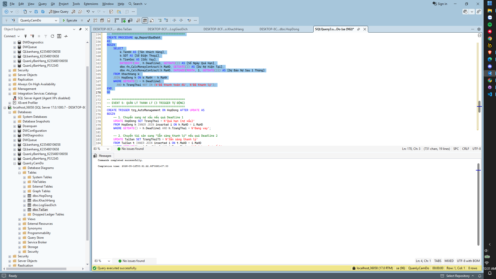

Event 5: Quản lý thanh lý tài sản

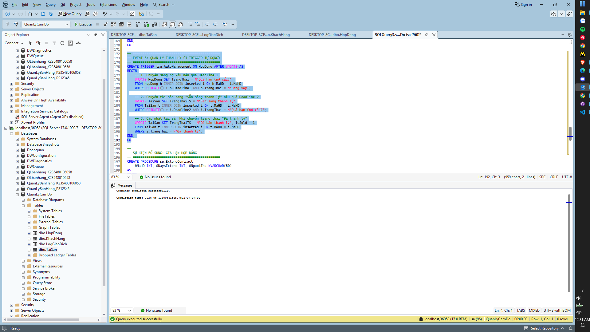

Các sự kiện bổ sung: 

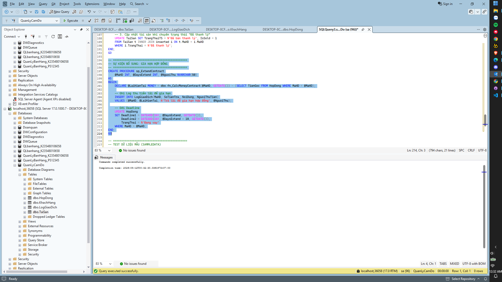

Test Dữ Liệu Mẫu:

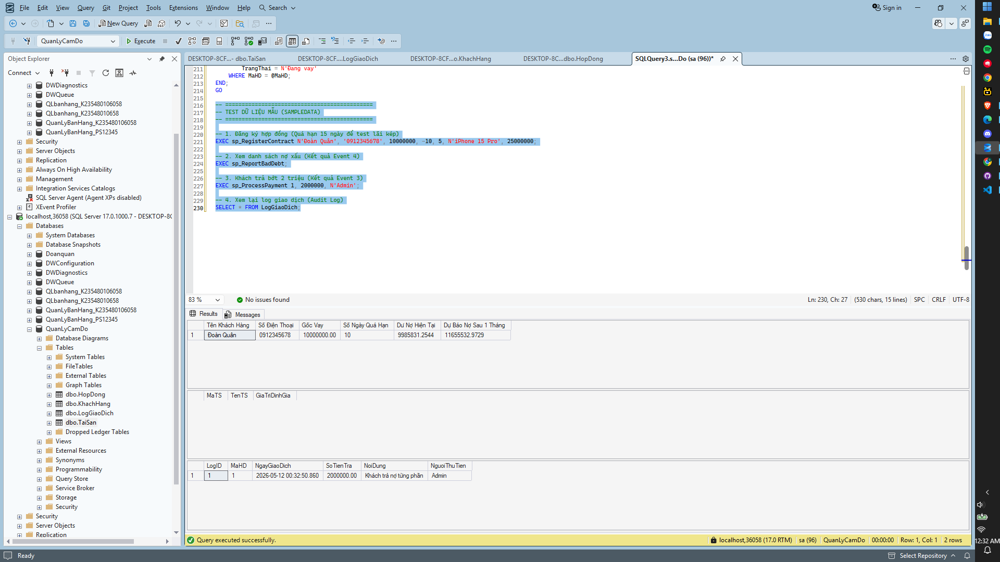

KẾT LUẬN DỰ ÁN

Sau quá trình nghiên cứu yêu cầu nghiệp vụ và thực hiện thiết kế, cài đặt hệ thống quản lý cầm đồ trên SQL Server, em đã hoàn thành dự án với các kết quả cụ thể như sau:

Về mặt thiết kế hệ thống: Xây dựng thành công cấu trúc cơ sở dữ liệu quan hệ đạt chuẩn 3NF, đảm bảo tính tối ưu và chặt chẽ qua sơ đồ ERD. Các mối quan hệ giữa Khách hàng, Hợp đồng, Tài sản và Nhật ký giao dịch được thiết lập logic, đảm bảo tính toàn vẹn dữ liệu ngay cả khi một hợp đồng có nhiều tài sản thế chấp.

Về mặt xử lý nghiệp vụ: Cài đặt chính xác thuật toán tính lãi suất linh hoạt, kết hợp nhuần nhuyễn giữa lãi đơn (trước hạn) và lãi kép (sau hạn) bằng hàm toán học. Điều này không chỉ đáp ứng đúng yêu cầu đề bài mà còn phản ánh sát thực tế mô hình kinh doanh cầm đồ hiện nay.

Về mặt kỹ thuật SQL: Vận dụng thành thạo và hiệu quả các đối tượng nâng cao để tối ưu hóa vận hành:

Function: Tính toán con số công nợ chính xác đến từng ngày.

Stored Procedure: Chuẩn hóa quy trình tiếp nhận hợp đồng và xử lý trả nợ, đảm bảo tính đóng gói của mã nguồn.

Trigger: Tự động hóa hoàn toàn việc chuyển trạng thái nợ xấu và thanh lý tài sản, giúp hệ thống vận hành thông minh và giảm thiểu sai sót do thao tác thủ công.

Về tính minh bạch và an toàn: Hệ thống đã giải quyết tốt bài toán theo dõi dòng tiền thông qua bảng Log (Audit Log), giúp chủ tiệm kiểm soát chi tiết từng lần trả nợ của khách. Đồng thời, cơ chế gợi ý trả hàng dựa trên giá trị tài sản còn lại giúp đảm bảo an toàn vốn và tối ưu hóa quan hệ khách hàng.

Dự án không chỉ giúp em củng cố kiến thức về hệ quản trị CSDL SQL Server mà còn rèn luyện kỹ năng tư duy giải quyết các bài toán nghiệp vụ phức tạp trong thực tế.s